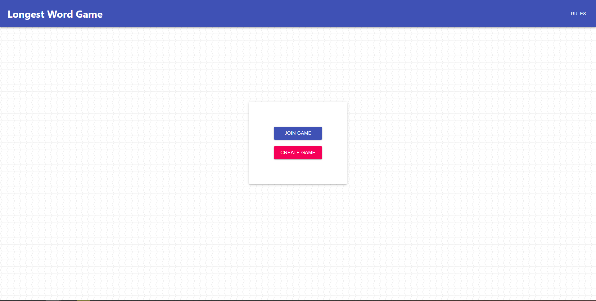
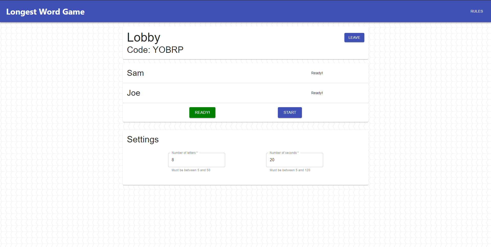
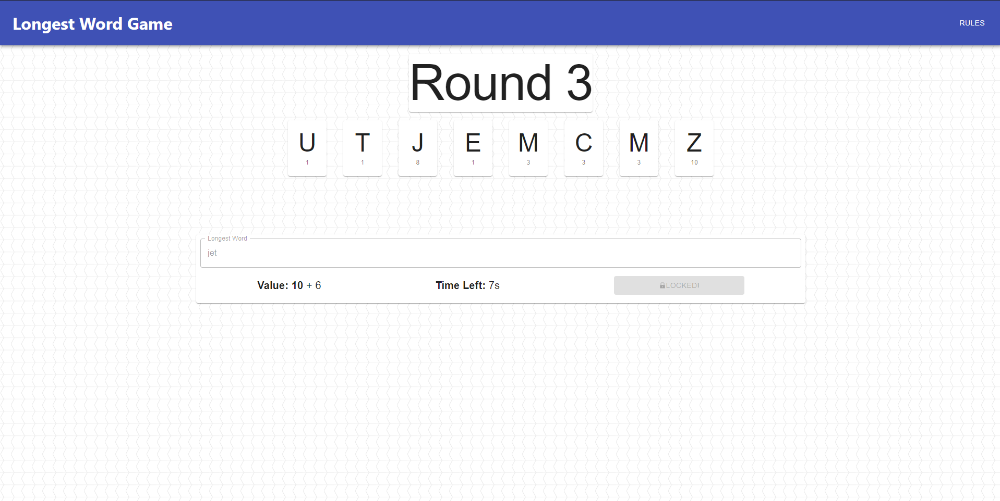
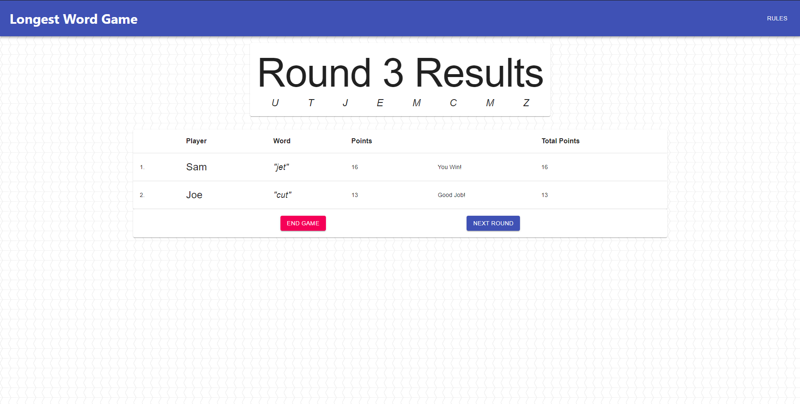

# Longest word game

Online multiplayer game built with react and firebase. Players look for the highest scoring word out of randomly generated letters as fast as possible

## Images

## Rules

### Setup

Create a lobby and share the access code with your friends! Once everyone has hit the ready button the games can begin.

### Gameplay

Each round you will see a list of letters, which you must try to find the highest scoring word before the time runs out.

### Scoring

Each letter of your word will have a different value; rarer letters are worth more. We use the same letter scoring system as Scrabble.

  * (1 point) -A, E, I, O, U, L, N, S, T, R.
  * (2 points) -D, G.
  * (3 points) -B, C, M, P.
  * (4 points) -F, H, V, W, Y.
  * (5 points) -K.
  * (8 points) -J, X.
  * (10 points) -Q, Z.

You will also get a bonus for finding a word before the timer is up. For every 2 seconds left on the timer when you lock in, you will earn an additional point.
